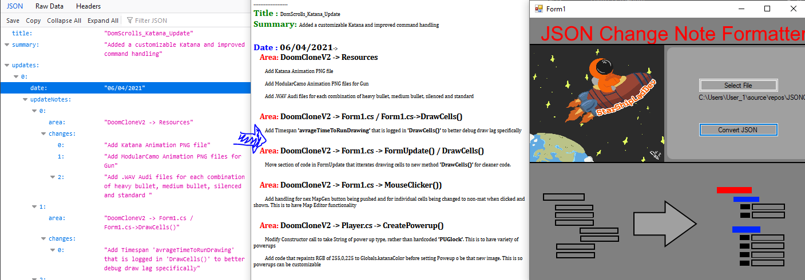

# JSONCOnverter -> JSON Changenote to HTML Converter



## Notes/Know Bugs:

> ~~Files that do not follow the format posted below will crash the application~~ - Resolved 15/08/2021

## Features(Planned In Brackets)

File selection.

Simple UI

Automatic conversion and execution of JSON to HTML

## Latest Build

*08/05/2021 - Main Build*
Generic JSON Build :


## View of progress

Generic JSON Build :


Main Build : 


## Latest Update Notes:

Generic JSON Build 


To Sum Up:
	Added the ability to handle generic JSO nfiles without following a deserialized structure
	
	Added generic html-formatting utility methods
	
	Refracted a lot of code

*THE BELOW CODE CAN BE DOWNLAODED AS A JSON FILE AND RUN WITH *

```
{
  "title": "JSONChangeNotesReaderApp",
  "summary": "Add core program",
  "Updates": {

    "JSONChangeNotesReaderApp": {

      "CreateWebFromJSON": {
        "APICallAsync": [
          "Modified method to use refracted methods (mentioned below) to have cleaner code"
        ],
        "AddBackgroundColor / AddColorBig ": [
          "Added utility features to return html formatted strings so that variosu common-functions of web-drawing can be called easily."
        ],
        "FindTokens": [
          "Added utility methods to loop through generic JSON object, passign the relevant depth recurrsivly to a new 'DIspalyModule'",
          "This is to allow any depth of JSON object to be drawn/ modifed",
          
        ],
        "class - DisplayModule": [
          "Add new class to handle drawing of each 'line' This  is to have cleaner/modualr code.",
          "Modifed constructor to call the relevant utility methods to format the inptu string correctly."
        ]

      },
      "Form1.cs": [
        "Modified reference to 'APICallAsync' from form1.cs to 'JSONChangeNotesReaderApp'"
      ]
    }
  },
  "toDo": [ "Completed for the time being" ]
}
	
	
```

## Latest Updates

## Next Build ([ ] -Not done , [0] - Half Done , [x] - Done)

Utility Acheived - No expected Updates


## Skill developing

I planned on this project improving my skills in the following:

>JSON Parsing

>HTML writing automation

>Lightweight GUI design

## Installing and Compiling:

Download and run 'JSOnConverter.exe' , then press the btton to select a .JSON file.

!!IMPORTANT!! - 'Newtonsoft.Json' must be in the same directory it runs from

Press 'Convert JSON' to convert that file to an HTML page and automatically run it in your PC's browser.

*Please note :*

JSON files you input must follow the below format (Comments following '#'):

```
{
	"title": "title", #optional
	"summary": "Add core program",#optional
	"TopHeader":{ # You may have unlimited of any header level
		"Header2":{
			"Leaf section of content 1":[
				"changeNote1",
				"ChangeNote2"
			],
			"Leaf section of content 2":[
				"changeNote3",
				"ChangeNote4"
			]
		},
		"Second Header2":{
			"Leaf section of content 1":[
				"changeNote1",
				"ChangeNote2"
			],
			"Leaf section of content 2":[
				"changeNote3",
				"ChangeNote4"
			]
		}
	}
}
	
```


